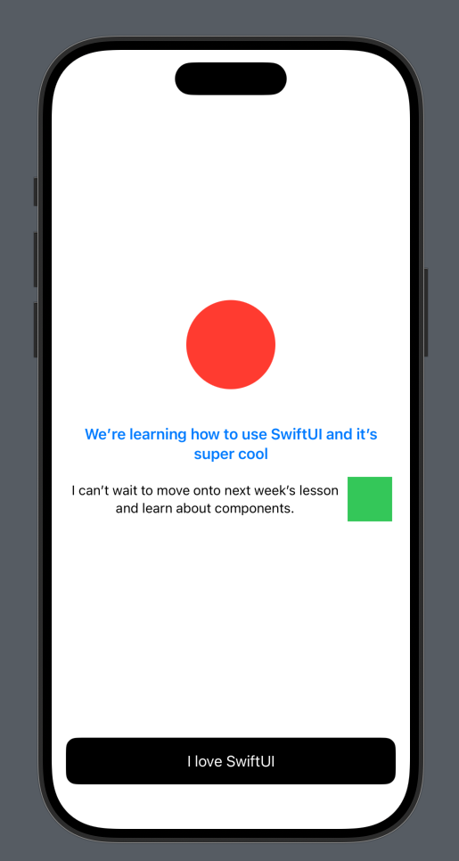

# Week 1: Foundations of SwiftUI Layout

## Overview
This week, we’ll explore the fundamental building blocks of SwiftUI layout, focusing on how to arrange views using stacks, modify them with common modifiers, and lay the foundation for creating dynamic and adaptive user interfaces.

## 1. View Structure

SwiftUI follows a **declarative** layout system, where you describe the structure and behavior of your user interface, and SwiftUI takes care of rendering and updating it as the user interacts with the app. Instead of manually controlling the UI's behavior, we specify what you want to appear and let SwiftUI handle the rest.

### Imperative vs Declarative:
In **Imperative UI**, we have to keep track of the state manually and update the UI accordingly. For instance, if we have two Boolean values, `A` and `B`, we end up with four possible states:

- A is off, B is off
- A is on, B is off
- A is off, B is on
- A is on, B is on

As we introduce more states, keeping track of state becomes rapidly more complex, requiring us to write more code to handle every possible combination.

In **Declarative UI**, like SwiftUI, we simply define what the UI should look like in each state, and SwiftUI takes care of switching between them automatically. For example, we can declare: "If the user is logged in, show a welcome message; if logged out, show a login button." We don't need to manually manage the transition between these states. SwiftUI automatically updates the UI when the state changes.

### Key Difference:
In declarative UI, we're not manually showing and hiding components. Instead, we provide the rules for what should be displayed based on state, and SwiftUI ensures the UI reflects those rules.

### View Structure in SwiftUI

SwiftUI views are structured differently from UIKit. There’s no explicit `viewDidLoad()` or similar lifecycle events—SwiftUI works declaratively, automatically managing the lifecycle for you. This shift can feel unfamiliar at first but simplifies state-driven UI updates.

### UIKit: Before (Imperative Approach)

In UIKit, you define the UI setup in methods like `viewDidLoad`:

```swift
import UIKit

class ViewController: UIViewController {
    override func viewDidLoad() {
        super.viewDidLoad()
        
        let label = UILabel()
        label.text = "Hello, UIKit!"
        label.translatesAutoresizingMaskIntoConstraints = false
        view.addSubview(label)
        
        NSLayoutConstraint.activate([
            label.centerXAnchor.constraint(equalTo: view.centerXAnchor),
            label.centerYAnchor.constraint(equalTo: view.centerYAnchor)
        ])
    }
}
```

### SwiftUI: After (Declarative Approach)

In SwiftUI, you describe the entire view directly in the `body` property. This declarative syntax replaces lifecycle management with a state-driven UI:

```swift
struct ContentView: View {
    var body: some View {
        Text("Hello, SwiftUI!")
    }
}
```

We also don't need any constraints for any views, layout constraints are implied — SwiftUI automatically calculates them based on the parent and child views.

Looking ahead: We can still call lifecycle events when the view loads with the `.onAppear{}` or `.task{}` viewModifiers. More on that to come

### Key Advantages

With SwiftUI:
- No Manual Constraints, SwiftUI determines layout automatically based on view modifiers and hierarchy.
- The body defines the UI at all states, and SwiftUI handles updates for you.
- Eliminates boilerplate code for adding and configuring views.

---

## 2. Stacks: HStack, VStack, and ZStack
In SwiftUI, Stacks are the core layout containers in SwiftUI and are used to arrange views in a linear order, much like UIStackView in UIKit. They are powerful yet simpler to implement, as they don’t require manual configuration of alignment, spacing, or constraints.

- **HStack**: Arranges views horizontally (left to right).
- **VStack**: Arranges views vertically (top to bottom).
- **ZStack**: Layers views on top of one another, allowing for depth-based positioning.

### HStack Example:
```swift
HStack {
    Text("Left")
    Text("Middle")
    Text("Right")
}
```

### VStack Example:
```swift
VStack {
    Text("Top")
    Text("Middle")
    Text("Bottom")
}
```

### ZStack Example:
```swift
ZStack {
    Text("I'm on bottom")
    Text("I'm on top")
}
```

### Padding and Alignment in Stacks

In SwiftUI, each stack (e.g., `VStack`, `HStack`, `ZStack`) provides two properties in its initializer that help control the layout of its content: `alignment` and `spacing`.

- **Alignment** specifies how the content inside the stack is aligned.
- **Spacing** defines the amount of space between each element in the stack.

#### Example 1: Using Stack's Initializer for Alignment and Spacing

```swift
VStack(alignment: .leading, spacing: 12) {
    Text("Top")
    Text("Middle")
    Text("Bottom")
}
```

This code creates a vertical stack where:
- The content is aligned to the **leading edge** (left-aligned).
- The spacing between each `Text` element is set to **12** points.

#### Example 2: Specifying Padding and Alignment for Each Element

Alternatively, you could apply individual padding and alignment to each element in the stack:

```swift
VStack {
    Text("Top")
        .padding(.bottom, 12)
        .multilineTextAlignment(.leading)
    Text("Middle")
        .padding(.bottom, 12)
        .multilineTextAlignment(.leading)
    Text("Bottom")
        .multilineTextAlignment(.leading)
}
```

While you can manually manage alignment and spacing by applying modifiers to each individual view inside the stack, using the stack's `alignment` and `spacing` properties makes it simpler and more efficient. With stacks, you set these properties at the container level, reducing the need for repetitive modifiers on each element.

### A Quick Note on `Group`

In SwiftUI, the `Group` container allows you to group multiple views together. It’s useful when you want to apply the same modifiers to a set of views without affecting the layout structure or hierarchy.

#### When to Use `Group`:
If you want to apply the same modifier to several views, you can wrap them in a `Group` and apply the modifier at once. This keeps your code clean and concise.

#### Example: Applying Modifiers to Multiple Views

```swift
Group {
    Text("First Item")
    Text("Second Item")
    Text("Third Item")
}
.padding()
.background(Color.blue)
```

In this example:
- The `Group` contains three `Text` views.
- The `.padding()`, `.background()` modifiers are applied to all three `Text` views at once.

It's not used as often but it's good to know that it exists.

---

## 3. Introduction to View Modifiers
View modifiers are used to change the appearance or behavior of views. These can be applied to any view and are a powerful way to customize the UI without altering the original view.

Commonly used view modifiers:
- **.padding**: Adds space around the view.
- **.background**: Sets a background for the view.
- **.foregroundStyle**: Sets the foreground style for the view
- **.frame**: Sets the frame for the view
  
### Example of Modifiers:
```swift
Text("Hello!")
    .padding()
    .background(.red)
```

This applies padding around the text and adds a red background around the view.

If you don’t specify any value, SwiftUI infers a default amount of padding:  
```swift
Text("Hello, SwiftUI!")
    .padding()
```

You can specify the padding for individual edges with a value:  
```swift
Text("Hello, SwiftUI!")
    .padding(.top, 12)
    .padding(.leading, 8)
```

Padding can be applied across multiple edges at once, simplifying your code:  
```swift
Text("Hello, SwiftUI!")
    .padding(.horizontal, 4) // Adds padding to left and right
```

Use an array to target multiple edges with the same value:  
```swift
Text("Hello, SwiftUI!")
    .padding([.top, .leading], 16) // Adds 16 points of padding to top and leading edges
```

### Adding Backgrounds in SwiftUI

In SwiftUI, there’s no dedicated modifier for backgrounds. Instead, the `.background()` modifier allows you to add any kind of view—color, shape, or image—as a background for your content.

#### Adding a Background Color
You can easily add a solid color as a background:  
```swift
Text("Hello, SwiftUI!")
    .padding()
    .background(Color.blue) // Adds a blue background
```

#### Using a Shape as a Background
Shapes can act as visually appealing backgrounds:  
```swift
Text("Hello, SwiftUI!")
    .padding()
    .background(
        RoundedRectangle()
            .fill(Color.green)
    )
```

#### Adding an Image as a Background
For more dynamic visuals, use an image as the background:  
```swift
Text("Hello, SwiftUI!")
    .padding()
    .background(
        Image("backgroundImage")
            .resizable()
            .scaledToFill()
    )
```

### Background VS ZStack

You might wonder why SwiftUI offers both `.background()` and `ZStack` for layering content. While they both allow you to place elements behind others, they serve different purposes and excel in different use cases.

---

#### Using `.background()`
The `.background()` modifier is tied to a specific view and follows its size and bounds. It’s ideal for simple cases where you want to decorate a view directly.

##### Example: Background Modifier
```swift
Text("Hello, SwiftUI!")
    .padding()
    .background(Color.blue) // Background automatically matches the text's size
    .foregroundColor(.white)
```

#### Using `ZStack`
`ZStack` lets you layer multiple views on top of each other. It’s useful for creating complex layouts or when you need precise control over the positioning of background elements.

##### Example: ZStack
```swift
ZStack {
    Color.blue // Full-screen background
    Text("Hello, SwiftUI!")
        .padding()
        .background(Color.white)
        .cornerRadius(8)
}
```

#### When to Use What
| **Scenario**                           | **Use**         |
|----------------------------------------|-----------------|
| Simple, view-bound background          | `.background()` |
| Complex layering or independent control | `ZStack`        |

---

## 4. Combining Stacks and Modifiers
You can combine stacks and modifiers to create more complex layouts. This allows you to build reusable components and structures.

### Example Combining VStack and HStack:
```swift
VStack {
    Text("SwiftUI")
        .font(.largeTitle)
        .padding()
        .background(Color.blue)
    HStack {
        Text("Left")
        Spacer()
        Text("Right")
    }
    .padding()
}
```

This layout will place a "SwiftUI" title at the top with some modifiers and then position two texts ("Left" and "Right") in a horizontal row.

---

## 5. Shapes

**Shapes** are fundamental building blocks used to draw and display various graphical elements.

SwiftUI offers several predefined shapes such as `Rectangle`, `Circle`, `Ellipse`, and `Capsule`.

#### Common Shapes

1. **Rectangle**:
   ```swift
   Rectangle()
       .frame(width: 200, height: 100)
   ```

2. **Circle**:
   ```swift
   Circle()
       .frame(width: 100, height: 100)
   ```

3. **Ellipse**:
   ```swift
   Ellipse()
       .frame(width: 200, height: 100)
   ```

4. **Capsule**:
   ```swift
   Capsule()
       .frame(width: 200, height: 50)
   ```

#### Styling Shapes

You can apply various modifiers to shapes, just like other views. These include:

- **Filling**: `.foregroundColor()`, `.fill()`, `.stroke()`
- **Borders**: `.border()`, `.strokeBorder()`
- **Shadows**: `.shadow()`
- **Gradients**: `.fill(LinearGradient())`, `.fill(RadialGradient())`

Example of a shape with gradient and shadow:

```swift
Rectangle()
    .fill(LinearGradient(gradient: Gradient(colors: [.yellow, .red]), startPoint: .top, endPoint: .bottom))
    .frame(width: 200, height: 100)
    .shadow(radius: 10)
```

## 6. Let's try an example

Now that we've covered some foundational concepts in SwiftUI, let's try a fun example to make a screen in SwiftUI.



<details>
  <summary>Click to reveal the answer</summary>
```swift
import SwiftUI

struct ContentView: View {
    var body: some View {
        VStack(spacing: 40) {
            Spacer()
            Circle()
                .foregroundStyle(.red)
                .frame(width: 100, height: 100)
            VStack(alignment: .center, spacing: 16) {
                Group {
                    Text("We’re learning how to use SwiftUI and it’s super cool")
                        .font(.headline)
                        .foregroundStyle(.blue)
                    HStack {
                        Text("I can’t wait to move onto next week’s lesson and learn about components.")
                            .font(.subheadline)
                        Rectangle()
                            .foregroundStyle(.green)
                            .frame(width: 50, height: 50)
                    }
                }
                .multilineTextAlignment(.center)
            }
            Spacer()
            Text("I love SwiftUI")
                .foregroundStyle(.white)
                .padding()
                .frame(maxWidth: .infinity)
                .background {
                    RoundedRectangle(cornerRadius: 12)
                        .foregroundStyle(.black)
                }
        }
        .padding()
    }
}

#Preview {
    ContentView()
}

```
</details>
